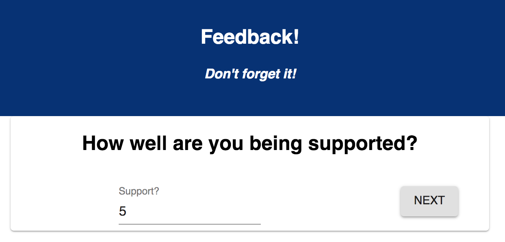
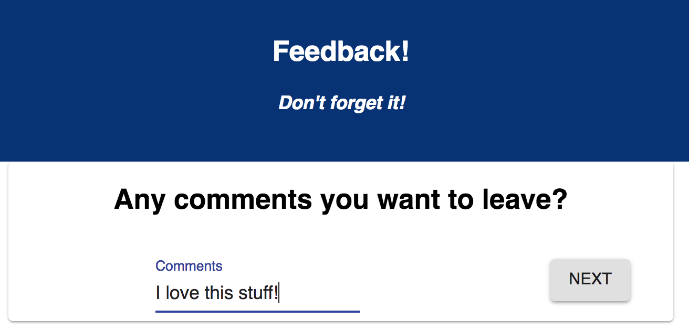

# Redux Feedback Loop

For this assignment, you will be creating a reflection/feedback form modeled after Prime's system. Feedback will be collected over 4 views. In a separate review page, display the current feedback values and a submit button. and when all steps are complete, your app will save the feedback in the database. 

- Store data in reducers

Page Flow:

1. Start Survey - App.jsx

2. Feeling - page one
- How are you feeling today?

3. Understanding - page two
- How well are you understanding the content?

4. Supported - page-three
- How well are you being supported?

5. Comments - page-four

- Any comments you want to leave?

6. Review List - review-active

The last step of the process will allow the user to review their feedback. Users are not able to change their input on this step or go back for Base Mode. 

- Review Your Feedback
-  List results of 
 - Feelings, understanding, support and comments
 - Submit button - routes to success page and sends information to the database

The `Review` step needs to have a submit button which will be clicked on to actually submit the completed feedback to the server.

When the submit button is clicked, save the submission in the database. The user should see a submission success page. They can then click the button to take a new survey, which needs to reset all the data and go back to the first step.

7. Success  - page five
(wireframes/page-five.png)

- Thank you for feedback
- button with handle use history to bring back to start of the survey

> NOTE: As a baseline requirement, you must use Redux to store your data across views.

EACH FORM _ OWN ROUTE
While there is no nav bar, each part of the form should be at its own route. Clicking next should move the user to the appropriate step in the process.

### Input Validation

Each step should only allow the user to advance to the next step if a score was provided. Be sure to tell the user in some way that a value must be provided.

The `Comments` step does not need to be validated, an empty value is okay.

